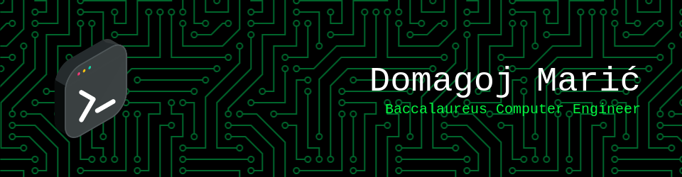

<h1 align="center">Hello, I am Domagoj! 👋</h1>

Computer science student passionate about Linux and Python, with a strong proficiency in C/C++. My projects reflect understanding of system-level programming and software development.
Eager to contribute to open source projects and continously learn new technologies.

<h2 align="center">Skills 💻</h2>

<h2 align="center">Still learning ⚡</h2>

<h2 align="center">GitHub stats 🚀</h2>

<!--
**domamaric/domamaric** is a ✨ _special_ ✨ repository because its `README.md` (this file) appears on your GitHub profile.

Here are some ideas to get you started:

- 🔭 I’m currently working on ...
- 🌱 I’m currently learning ...
- 👯 I’m looking to collaborate on ...
- 🤔 I’m looking for help with ...
- 💬 Ask me about ...
- 📫 How to reach me: ...
- 😄 Pronouns: ...
- ⚡ Fun fact: ...
-->
